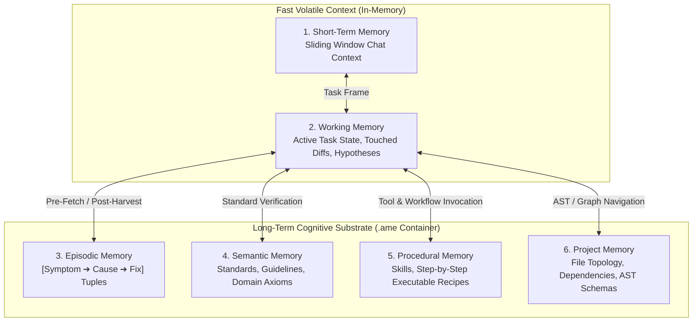
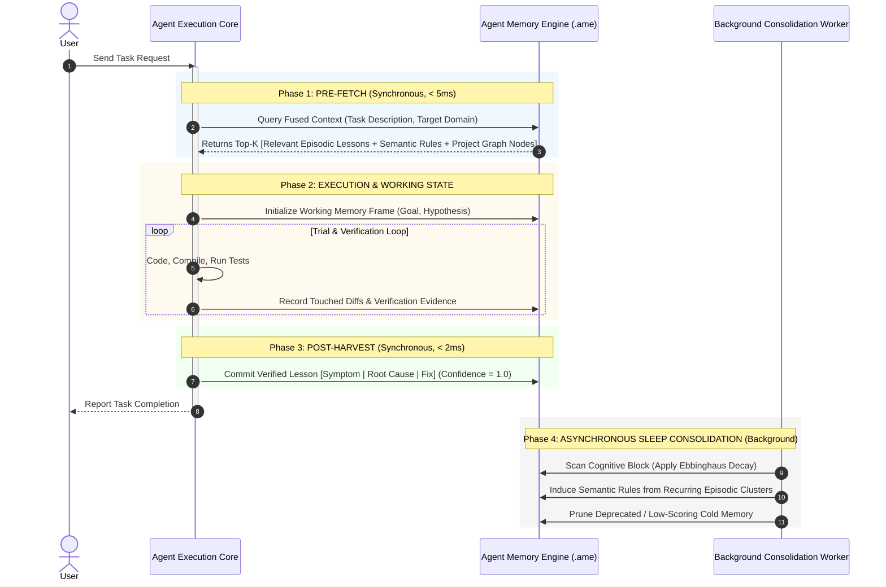

# 01. Architecture Overview: Cognitive Memory Engine

---

## 1. The Core Paradigm Shift

Traditional Large Language Model (LLM) agents suffer from **State Amnesia** and **Context Pollution**. Current solutions attempt to mitigate this by stitching together disconnected tools:
- **Vector DBs** provide similarity-based document chunks, but ignore temporal relevance, frequency of utility, and structured task relationships.
- **Relational Databases** enforce rigid schemas and lack semantic fuzzy-matching.
- **Session Windows** are strictly bounded by context token limits and cost budgets.

**Agent Memory Engine (AME)** establishes a **unified cognitive substrate** modeled after biological cognitive psychology and modern systems programming (Memory Hierarchy).

```
+-------------------------------------------------------------------------+
|                          MEMORY HIERARCHY MODEL                         |
+=========================================================================+
|  Tier               | Latency    | Volatility | Primary Purpose         |
|---------------------+------------+------------+-------------------------|
|  1. Short-Term      | < 0.1 ms   | Ultra-High | Conversation Buffer     |
|  2. Working Memory  | < 0.5 ms   | High       | Active Task Scratchpad  |
|  3. Episodic        | < 2.0 ms   | Low        | Historical Experiences  |
|  4. Semantic        | < 2.0 ms   | Persistent | Rules & Universal Facts |
|  5. Procedural      | < 1.0 ms   | Persistent | Actionable Skills & Flow|
|  6. Project Memory  | < 5.0 ms   | Structured | Codebase AST & Topology |
+-------------------------------------------------------------------------+
```

---

## 2. The 6-Tier Memory Taxonomy



### 2.1. Short-Term Memory (STM)
- **Scope:** Immediate conversation turn buffer.
- **Characteristics:** Volatile, lives strictly in memory, slides with the active LLM context window.
- **Lifespan:** Active conversation session.

### 2.2. Working Memory (WM)
- **Scope:** The operational state of the current task.
- **Contents:**
  - Active task goal & sub-goals.
  - Set of touched files and uncommitted diffs.
  - Active diagnostic evidence (compiler output, error traces, HTTP responses).
  - Current hypothesis being tested (`"Hypothesis: Bug caused by NullRef in OrderService.cs:42"`).
- **Special Capability:** **Memory Branching & Checkpoint (Copy-on-Write)**. When exploring speculative hypotheses, the agent forks Working Memory; if the hypothesis fails, it rolls back cleanly without polluting subsequent reasoning steps.

### 2.3. Episodic Memory (EM)
- **Scope:** Past experiences and lessons learned from problem-solving.
- **Format:** Structured Triplet: `[Problem / Symptom] | [Root Cause] | [Verified Fix & Gotchas]`.
- **Retrieval:** Triggered during the **Pre-Fetch** phase of any complex task to prevent repeating prior mistakes.

### 2.4. Semantic Memory (SM)
- **Scope:** Universal rules, architectural patterns, coding standards, and domain facts.
- **Characteristics:** High confidence ($C = 1.0$), low decay rate ($\lambda \approx 0$).
- **Origin:** Curated by human engineers or synthesized by autonomous memory consolidation from recurring episodic patterns.

### 2.5. Procedural Memory (PM)
- **Scope:** Actionable "How-To" knowledge, executable recipes, skill workflows, and tool execution sequences.
- **Format:** Deterministic state machines or parameterized script templates.

### 2.6. Project Memory (PRJM)
- **Scope:** Structural topology and dependency matrix of the target workspace.
- **Contents:** Module dependency graphs, database schemas, symbol reference tables (Tree-sitter AST nodes), and file coupling metrics.

---

## 3. The Dual-Phase Cognitive Lifecycle

To guarantee memory utility without bogging down agent execution, AME enforces a strict **Dual-Phase Lifecycle**:



---

## 4. Architectural Invariants

Every implementation of AME must uphold the following four invariants:

1. **Deterministic State Accountability:** Working Memory must track all environment side-effects (modified files, running processes, staged DB changes) with zero ambiguity.
2. **Evidence-Gated Persistence:** No Episodic Memory record may be written with `Confidence = 1.0` unless verified by concrete evidence (clean build, passing unit test, or successful assertion).
3. **Single-Pass Fusion:** The retrieval pipeline must evaluate vector similarity, relationship links, recency decay, and importance within a single unified scan.
4. **Non-Blocking Governance:** Memory decay, clustering, and consolidation must run asynchronously without impacting the primary agent execution loop.
