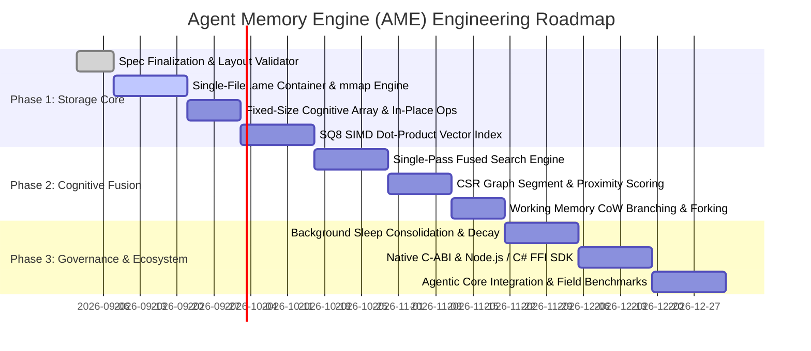

# 05. Implementation Roadmap & Verification Strategy

---

## 1. Phased Implementation Roadmap

---

## 2. Performance & Resource Targets

| Metric | Target Goal | Standard RAG / Vector DB Benchmark |
| :--- | :--- | :--- |
| **Fused Retrieval Latency (Top-5)** | **$< 1.5\text{ ms}$** (Zero-copy `mmap`) | $45 - 120\text{ ms}$ (Multi-query overhead) |
| **In-Place Cognitive Update Latency** | **$< 50\text{ }\mu\text{s}$** (Atomic struct write) | $15 - 40\text{ ms}$ (Relational SQL update / re-index) |
| **Memory Footprint (100,000 memories)**| **$< 65\text{ MB}$** (SQ8 Quantized + CSR) | $450 - 900\text{ MB}$ (Unquantized FP32 in RAM) |
| **Storage Container Portability** | **1 Single File (`.ame`)** | Requires external daemon server / multi-file tables |

---

## 3. Verification & Test Vector Strategy

To guarantee crash resilience, numerical correctness, and performance stability, the following test suites must be implemented:

### 3.1. Binary Format & Alignment Integrity Tests
- **Byte Boundary Validation:** Verify all segment offsets are strictly $64$-byte aligned.
- **Endianness Cross-Test:** Ensure `.ame` files created on x86-64 can be read identically on ARM64.
- **Fuzzing & Checksum Verification:** Inject bit flips into payload segments to verify `xxHash64` error detection.

### 3.2. Cognitive Scoring & Decay Invariant Tests
- **Decay Monotonicity:** Ensure retention $R(t)$ strictly decreases over time for $\Delta t > 0$ when $\text{DecayRate} > 0$.
- **Frequency Resistance:** Assert that a record accessed $10\times$ retains $> 80\%$ score after 7 days, while a single-access record decays to $< 30\%$.
- **Semantic Permanence:** Verify that records marked with `DecayRate = 0` experience zero score degradation across simulated 10-year spans.

### 3.3. Concurrency & Crash Resilience Tests
- **Power-Cut Simulation:** Terminate process abruptly during `ame_store_episodic()` to ensure the WAL replays cleanly on reboot without partial corruptions.
- **Multi-Reader Single-Writer Lock:** Validate concurrent lock-free reads while the background consolidation worker executes decay passes.
